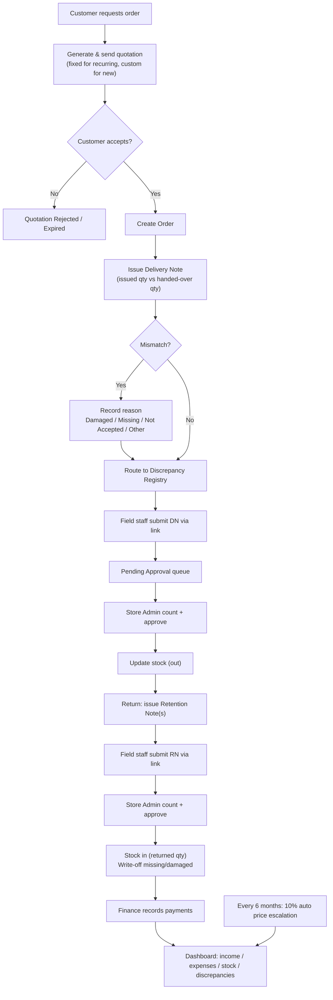
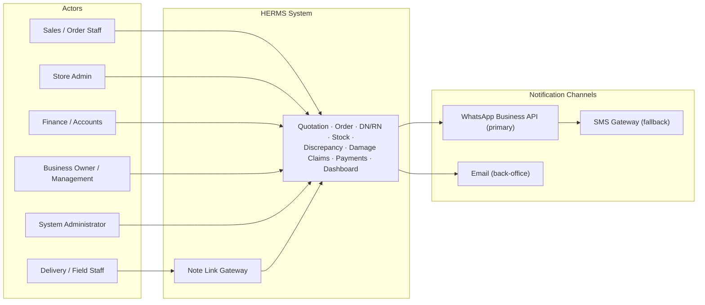

**VIZUALABS**

# Hotel Equipment Rental Management System (HERMS)

> [!info] Document Details
> **Document:** Software Requirements Specification
> **Version:** 1.0
> **Status:** Draft for Review
> **Date:** 11 August 2026
> **Prepared by:** Vizualabs (Pvt) Ltd — info@vizualabs.com

---

## 1. Introduction

### 1.1 Purpose

This Software Requirements Specification (SRS) defines the functional and non-functional requirements for the **Hotel Equipment Rental Management System (HERMS)** — a system to be built for a business that rents cutlery and crockery (spoons, forks, soup bowls, and related equipment) to hotels and event organisers. This document is intended to be reviewed and approved by the business owner and used by the Vizualabs development team as the basis for design, development, testing, and delivery of the system.

### 1.2 Document Conventions

> [!note] Naming Conventions
> - **FR-<section>.<n>** — Functional Requirements (e.g., FR-3.1)
> - **BR-<n>** — Business Rules
> - **Priority (MoSCoW):** Must Have (M), Should Have (S), Could Have (C)

### 1.3 Intended Audience

| Audience | Purpose |
|----------|---------|
| Business owner / management | Requirement validation and sign-off |
| Vizualabs project and development team | Design and implementation |
| Store admin, sales/order staff, and delivery staff | End users referenced throughout |
| QA team | Test case derivation |

> [!important] Client Note
> The end of the day, the system will be used by the Business Owner — which means the Store Admin and a few staff members, and customers only.

### 1.4 Project Scope

The system will digitise the full rental cycle for hotel equipment: quotation, order acceptance, delivery note issuance, retention (return) note processing, stock and discrepancy tracking, damage claims, pricing (including automatic periodic price escalation), payments, and management reporting through a dashboard. The initial scope covers a single business entity operating from one or more stores, serving recurring and new hotel/event customers.

> [!abstract] Out of Scope (Initial Release)
> - Multi-currency support
> - Integration with third-party accounting software
> - Customer-facing self-service ordering portal (customers place orders via sales staff; a self-service portal is noted as a future enhancement in Section 10)

### 1.5 Definitions, Acronyms and Abbreviations

| Term | Definition |
|------|------------|
| **Delivery Note (DN)** | Document/record created when stock is issued from the store and handed over to the customer, capturing quantity issued from stores vs. quantity actually handed over. |
| **Retention Note (RN)** | Document/record created when equipment is returned by the customer, capturing quantity returned, balance still outstanding, and missing/damaged quantity. |
| **Discrepancy** | Any mismatch between issued, delivered, returned, or balance quantities, recorded with a reason and a responsible party. |
| **Recurring Customer** | A customer with an approved fixed price list applied to all orders. |
| **New Customer** | A customer without a fixed price agreement; pricing is quoted on a custom, per-order basis. |
| **Store Admin** | The role responsible for verifying and accepting equipment counted back into the store and updating stock. |
| **Responsible Party** | The party (customer or staff member) identified as accountable for a missing or damaged item. |

### 1.6 References

- Business case and process description provided by the client (source of this SRS), dated 11 August 2026.
- IEEE 830 / ISO/IEC/IEEE 29148 — general SRS structure conventions used as a template basis.

---

## 2. Overall Description

### 2.1 Product Perspective

HERMS is a **new, standalone business-management system**. It replaces the current manual, paper-based process (physical delivery notes and retaining notes) with a digital workflow while preserving the same real-world documents (delivery note, retention note) so that existing operational habits are not disrupted. The system centralises stock, orders, payments, and discrepancy data that is today untracked.

### 2.2 Product Functions — Summary

- Quotation generation and delivery to recurring or new customers, using the applicable pricing model
- Order acceptance and system-generated delivery note (store-issued qty vs. handed-over qty, with reasons for any mismatch)
- Retention (return) note processing (returned qty, balance qty, missing/damaged qty, with reason and responsible party)
- Field-staff submission of delivery/retention notes via a shared link, with store admin count-and-approve before stock updates
- Live stock quantity and stock value tracking
- Missing/damaged item registry with reason, responsible party, and "most missing/damaged item and customer" analysis
- Damage claim billing to customers, and automatic 10% price escalation of equipment every six months
- Payment tracking: pending vs. received payments, monthly income and expenses
- Management dashboard visualising stock, discrepancies, and financials

### 2.3 User Classes and Characteristics

| User Class | Description / System Interaction |
|------------|----------------------------------|
| **Business Owner / Management** | Views dashboards and reports (stock, financials, discrepancies); has no operational data-entry duties; approves pricing rules. |
| **Sales / Order Staff** | Creates customer records, generates quotations, converts accepted quotations to orders. |
| **Delivery / Field Staff** | Prepares and submits delivery notes at hand-over and retention notes at return, via a link sent to their device. |
| **Store Admin** | Verifies physical counts against submitted delivery/retention notes, approves them, and triggers stock updates. |
| **Finance / Accounts Staff** | Records payments received, tracks pending payments, records expenses, raises damage claim invoices. |
| **System Administrator** | Manages users, roles, permissions, and system configuration (e.g., price escalation schedule). |

### 2.4 Operating Environment

- Web-based application accessible from **desktop browsers** (store/back-office use) and **mobile browsers** (field staff, via shared links).
- Cloud-hosted backend and database with **role-based access control**.
- Notifications delivered via **WhatsApp, SMS, or email** link (channel to be confirmed with the client).

### 2.5 Design and Implementation Constraints

- Delivery and retention notes must be submitted through a **shareable link** so that field staff do not require a full login on personal devices.
- **No stock quantity may be updated** until a store admin has confirmed a physical count against the submitted note — this is a mandatory control point, not optional.
- Pricing logic must support **two concurrent models**: a fixed price list per recurring customer and an ad-hoc custom price per quotation for new customers.

### 2.6 Assumptions and Dependencies

- The client will confirm the exact fields required on printed/PDF delivery and retention notes to match existing paper formats used with hotels.
- The client will confirm which notification channel (WhatsApp Business API, SMS gateway, or email) is available for sending links.
- Equipment types (spoons, forks, soup bowls, etc.) are counted in **whole units**; no batch/lot tracking is assumed unless specified.

---

## 3. System Features (Functional Requirements)

Requirements are grouped by feature area. Priorities follow MoSCoW: Must Have (M), Should Have (S), Could Have (C).

### 3.1 Customer & Pricing Management

Manages customer master data and the two pricing models described in the business case.

| ID | Functional Requirement | Priority |
|----|------------------------|----------|
| FR-1.1 | The system shall allow creation and maintenance of customer records, including a customer type of Recurring or New. | M |
| FR-1.2 | For a Recurring customer, the system shall store a fixed price per equipment item that is used automatically on every quotation and order. | M |
| FR-1.3 | For a New customer, the system shall allow sales staff to enter a custom price per item at the time of quotation. | M |
| FR-1.4 | The system shall allow a customer's status to be changed from New to Recurring, at which point a fixed price list is set for that customer. | S |
| FR-1.5 | The system shall maintain a price history per equipment item, including the reason for each change (e.g., scheduled escalation, negotiated rate). | S |

### 3.2 Quotation Management

Covers system-generated quotations sent to a customer when an order is requested.

| ID | Functional Requirement | Priority |
|----|------------------------|----------|
| FR-2.1 | When a customer requests an order, the system shall generate a quotation listing each equipment item, quantity, applicable unit price (fixed or custom), and total value. | M |
| FR-2.2 | The system shall send the generated quotation to the customer (WhatsApp). | M |
| FR-2.3 | The system shall record the quotation status (Sent, Accepted, Rejected, Expired). | M |
| FR-2.4 | On acceptance of a quotation, the system shall allow conversion of the quotation into an order without re-entering line items. | M |

### 3.3 Order & Delivery Note Management

Covers issuing stock from stores and handing it over to the hotel/customer.

| ID | Functional Requirement | Priority |
|----|------------------------|----------|
| FR-3.1 | On accepting an order, the system shall generate a delivery note recording, per item, the quantity issued from the store and the quantity actually handed over to the customer. | M |
| FR-3.2 | If issued quantity and handed-over quantity do not match for an item, the system shall require a reason to be recorded, selected from: Damaged, Missing, or Not Accepted (by customer), and Other (with mandatory free-text detail). | M |
| FR-3.3 | The system shall route delivery notes with a mismatch to the Discrepancy & Damage Registry (Section 3.5) automatically. | M |
| FR-3.4 | The system shall allow the delivery note to be generated as a shareable link for field staff to complete and submit on-site. | M |
| FR-3.5 | The system shall not update stock quantities from a delivery note until it has been approved by a store admin (see Section 3.7). | M |

### 3.4 Retention (Return) Note Management

Covers the return of equipment from the hotel/customer back to the store.

| ID | Functional Requirement | Priority |
|----|------------------------|----------|
| FR-4.1 | When equipment is returned, the system shall generate a retention note recording, per item, the quantity retained/returned, the balance still outstanding with the customer, and the missing/damaged quantity. | M |
| FR-4.2 | The system shall validate that, across all retention notes submitted against an order, cumulative returned quantity + balance quantity + missing/damaged quantity equals the original delivered quantity for each item. Full reconciliation is enforced when the order is marked Fully Returned, not on each individual partial note. | M |
| FR-4.3 | Where the reconciliation in FR-4.2 does not match, the system shall require the discrepancy to be recorded as Missing, Damaged, or Other (free text), along with the responsible party: Customer or Staff Member. | M |
| FR-4.4 | The system shall allow the retention note to be generated as a shareable link for field staff to complete and submit on return collection. | M |
| FR-4.5 | The system shall not update stock quantities from a retention note until it has been approved by a store admin (see Section 3.7). | M |
| FR-4.6 | A single order may have multiple partial retention notes (partial returns over time) until the full delivered quantity is accounted for. This is required for launch, not deferred. | S |
| FR-4.7 | A submitted (not yet approved) retention or delivery note may be corrected by the submitting field staff member up until the point the store admin begins the approval count; once approval is finalized, correction requires FR-7.7 (reopening). | S |

### 3.5 Discrepancy, Missing & Damage Registry

A central, queryable record of every mismatch raised at delivery or at return.

| ID | Functional Requirement | Priority |
|----|------------------------|----------|
| FR-5.1 | The system shall maintain a discrepancy registry capturing: order/customer, item, quantity, discrepancy type (Missing, Damaged, Not Accepted, Other), reason, responsible party, date, and originating note (delivery or retention). | M |
| FR-5.2 | The dashboard shall display all open missing/damaged records with item, quantity, reason, and responsible party. | M |
| FR-5.3 | The system shall provide a report/view of the most frequently missing or damaged items, ranked by quantity and/or value. | M |
| FR-5.4 | The system shall provide a report/view of the customers most associated with missing or damaged items, ranked by quantity and/or value. | M |
| FR-5.5 | The system shall allow a discrepancy record to be marked as Resolved, Written Off, or Claimed (linked to Section 3.10). | S |

### 3.6 Stock Management

Maintains a real-time, accurate view of equipment quantity and value.

| ID | Functional Requirement | Priority |
|----|------------------------|----------|
| FR-6.1 | The system shall maintain a live stock ledger per equipment item, updated only from approved delivery notes (stock out) and approved retention notes (stock in). | M |
| FR-6.2 | The system shall calculate current stock value using the current unit price of each item. | M |
| FR-6.3 | The system shall reduce available stock by quantities recorded as permanently Missing or Damaged (and not returned to usable stock) once a discrepancy is confirmed. | M |
| FR-6.4 | The system shall alert store admins when an item's available stock falls below a configurable reorder threshold. | C |
| FR-6.5 | A confirmed discrepancy write-off may be reversed by a Store Admin within a configurable correction window (default 7 days) with a mandatory reason, restoring the stock; beyond the window, reversal requires a System Administrator override. All reversals are logged as new audit entries, not edits to the original record. | S |

### 3.7 Store Admin Approval Workflow

The mandatory verification step before any stock movement is posted.

| ID | Functional Requirement | Priority |
|----|------------------------|----------|
| FR-7.1 | When a staff member submits a delivery note or retention note via link, the system shall place it in a Pending Approval queue visible to the assigned Store Admin and any Deputy Store Admin(s) for that store. | M |
| FR-7.2 | The store admin shall physically count the equipment handed over to the store and enter the counted quantity against the submitted note. | M |
| FR-7.3 | If the store admin's counted quantity differs from the submitted note, the system shall flag the difference for review before final approval. | M |
| FR-7.4 | Only after store admin approval shall the system update stock quantities and close the note. | M |
| FR-7.5 | The system shall keep a full audit trail of who submitted, who approved, and any adjustments made during approval. | S |

### 3.8 Payment & Invoicing Management

Tracks amounts owed and paid per order/customer.

| ID | Functional Requirement | Priority |
|----|------------------------|----------|
| FR-8.1 | The system shall generate an invoice value per order based on the quotation/order pricing. | M |
| FR-8.2 | The system shall record payments received against an order/invoice, including partial payments. | M |
| FR-8.3 | The system shall calculate and display pending (outstanding) payment balance per customer and per order. | M |
| FR-8.4 | The system shall record business expenses (category, amount, date, description) independent of customer orders. | M |
| FR-8.5 | The system shall calculate monthly income (payments received) and monthly expenses, and the resulting net position. | M |

### 3.9 Damage Claims & Automatic Price Escalation

Billing for confirmed customer-responsible damage, and scheduled price increases.

| ID | Functional Requirement | Priority |
|----|------------------------|----------|
| FR-9.1 | Where a discrepancy is marked Damaged with responsible party Customer, the system shall allow a damage claim to be raised, billing the customer at the item's current unit price. | M |
| FR-9.2 | A raised damage claim shall be added to the customer's outstanding balance and reflected in pending payments once confirmed (see FR-9.6). | M |
| FR-9.3 | The system shall automatically increase each equipment item's unit price by 10% every six months from a configurable effective date. | M |
| FR-9.4 | Each price escalation shall be logged in the price history (see FR-1.5) with the effective date and previous/new price. | M |
| FR-9.5 | Damage claims raised after an escalation date shall use the price in effect on the date the damage was recorded, not a later or earlier price. | S |
| FR-9.6 | Before a damage claim raised under FR-9.1 is added to the customer's outstanding balance, it shall require review and confirmation by a Finance/Accounts user. | M |
| FR-9.7 | Price history entries shall be immutable once written; any correction shall be made via a new offsetting entry, never an in-place edit. | M |

### 3.10 Dashboard & Reporting

Management visibility across stock, discrepancies, and finances.

| ID | Functional Requirement | Priority |
|----|------------------------|----------|
| FR-10.1 | The dashboard shall display current stock quantity and stock value by item. | M |
| FR-10.2 | The dashboard shall display total pending payments and total received payments for the current month, with trend over prior months. | M |
| FR-10.3 | The dashboard shall display monthly income vs. monthly expenses, with net income/loss. | M |
| FR-10.4 | The dashboard shall display damaged/missing items, their value, reason, and responsible party, filterable by date range, customer, and item. | M |
| FR-10.5 | The dashboard shall display the most missing/damaged items and the associated customers (from FR-5.3/FR-5.4). | M |
| FR-10.6 | Reports shall be exportable (e.g., to PDF/Excel) for offline sharing. | S |
| FR-10.7 | The dashboard shall display any pending price escalation actions awaiting Business Owner/Management confirmation (see FR-9.7). | S |

### 3.11 Notification & Link-Based Note Submission

The mechanism by which field staff receive and complete notes.

| ID | Functional Requirement | Priority |
|----|------------------------|----------|
| FR-11.1 | The system shall generate a unique, time-bound link for each delivery note and retention note, sent to the assigned staff member. | M |
| FR-11.2 | The link shall open a mobile-friendly form pre-filled with the order's items, allowing the staff member to enter actual quantities and reasons. | M |
| FR-11.3 | On submission via the link, the note shall move to the Pending Approval queue (see Section 3.7). | M |
| FR-11.4 | The system shall notify the store admin when a note is awaiting approval, and notify sales/finance staff when a note is approved. | S |
| FR-11.5 | A Store Admin or Sales staff member shall be able to resend or regenerate a note-submission link (e.g., if lost or expired); each resend is with the user. | M |

### 3.12 User & Role Management

Access control across the user classes defined in Section 2.3.

| ID | Functional Requirement | Priority |
|----|------------------------|----------|
| FR-12.1 | The system shall support role-based access control for Business Owner, Sales/Order Staff, Delivery/Field Staff, Store Admin, Finance/Accounts, and System Administrator roles. | M |
| FR-12.2 | Field staff shall be able to submit notes via link without requiring a full system login. | M |
| FR-12.3 | All financial and stock-affecting actions shall be attributable to an authenticated user or verified link token. | M |

---

## 4. External Interface Requirements

### 4.1 User Interfaces

- Back-office web application (desktop-first) for sales, store admin, finance, and management.
- Mobile-responsive link-based forms for delivery note and retention note submission by field staff.
- Dashboard views optimised for both desktop and tablet.

### 4.2 Hardware Interfaces

No specialised hardware is required for the initial release. Barcode/RFID scanning for equipment counting is noted as a future enhancement (Section 10).

### 4.3 Software Interfaces

- Messaging channel (**WhatsApp Business API**) for sending quotations and delivery/retention note links — provider to be confirmed.
- Optional future integration with accounting software for exporting income/expense data.

> [!tip] Notification Strategy
> Primary channel **WhatsApp Business API**, automatic fallback to **SMS gateway** if WhatsApp delivery fails (FR-11.5), with **email** available for back-office notifications.

### 4.4 Communication Interfaces

All client-server communication shall use **HTTPS**. Shareable note links shall be **single-use or time-bound tokens** to prevent unauthorised access.

---

## 5. Data Requirements

### 5.1 Key Data Entities

| Entity | Key Attributes (indicative) |
|--------|-----------------------------|
| **Customer** | Name, type (Recurring/New), contact details, fixed price list (if recurring), outstanding balance |
| **Equipment Item** | Name, category, current unit price, price history, current stock qty, unit of measure |
| **Quotation** | Customer, items & quantities, unit price used, total value, status, date |
| **Order** | Linked quotation, customer, status, associated delivery/retention notes |
| **Delivery Note** | Order, item lines (issued qty, handed-over qty, reason if mismatched), submitted-by, approved-by, status |
| **Retention Note** | Order/delivery note reference, item lines (returned qty, balance qty, missing/damaged qty, reason, responsible party), submitted-by, approved-by, status |
| **Discrepancy Record** | Source note, item, type (missing/damaged/not accepted), reason, responsible party, value, resolution status |
| **Payment** | Order/customer, amount, date, method, remaining balance |
| **Expense** | Category, amount, date, description |
| **Price History** | Item, old price, new price, effective date, reason (escalation/negotiated) |
| **User** | Name, role, contact, credentials/access token |

### 5.2 Data Retention

Transactional records (quotations, notes, payments, discrepancies) shall be retained **indefinitely** to support historical reporting and audit, unless the client specifies a different retention policy.

---

## 6. Non-Functional Requirements

### 6.1 Performance

Dashboard views shall load within **3 seconds** under normal load for a data set of up to several years of transactions.

### 6.2 Security

- Role-based access control shall restrict data and actions to authorised roles (Section 3.12).
- Note-submission links shall expire after a configurable period and shall not expose data beyond the specific order.
- All financial data changes shall be logged with user, timestamp, and before/after values.

### 6.3 Availability & Reliability

- The system shall target **99.5% uptime** for the back-office and dashboard modules.
- Stock quantities shall **never be updated without a corresponding approved note** (data integrity control, FR-3.5/FR-4.5).

### 6.4 Usability

Link-based note forms shall be completable on a mobile device in **under 2 minutes** for a typical order.

### 6.5 Scalability

The data model shall support **multiple stores/branches in a future phase without redesign**.

### 6.6 Auditability

Every stock movement, price change, discrepancy, and payment shall be traceable to a source document and user.

---

## 7. Business Rules

| ID | Business Rule |
|----|---------------|
| **BR-1** | Recurring customers are always priced using their stored fixed price list; new customers are priced using a custom price entered per quotation. |
| **BR-2** | Any mismatch between store-issued quantity and customer-handed-over quantity at delivery must be recorded with a reason: Damaged, Missing, or Not Accepted. |
| **BR-3** | At return, returned qty + balance qty + missing/damaged qty must reconcile to the original delivered qty; any shortfall must be recorded as Missing or Damaged with a responsible party (Customer or Staff Member). |
| **BR-4** | No stock quantity is updated in the system until a store admin has physically counted and approved the corresponding delivery or retention note. |
| **BR-5** | A damage claim may be billed to a customer only where the discrepancy's responsible party is Customer. |
| **BR-6** | Each equipment item's unit price automatically increases by 10% every six months; damage claims use the price in effect on the date of the damage record. |

---

## 8. Process Workflow Overview

The end-to-end process flow implemented by the system is as follows:

1. Customer requests an order → system generates and sends a quotation using the applicable pricing model (fixed for recurring, custom for new).
2. Customer accepts the quotation → order is created.
3. Order is fulfilled: a delivery note is issued, capturing store-issued qty and customer-handed-over qty; any mismatch is recorded with a reason.
4. Field staff submit the delivery note via link → store admin counts and approves → stock is reduced.
5. At the end of the rental period, equipment is collected/returned: a retention note is issued, capturing returned qty, balance qty, and missing/damaged qty with reason and responsible party.
6. Field staff submit the retention note via link → store admin counts and approves → stock is increased by returned qty; confirmed missing/damaged qty is written off from usable stock.
7. Confirmed customer-responsible damage may be billed as a damage claim, added to the customer's outstanding balance.
8. Finance records payments against outstanding balances; pending and received payments, income, and expenses are visualised on the dashboard.
9. Every six months, the system automatically escalates each item's unit price by 10%.

---

## 9. Dashboard & Reporting Requirements Summary

The management dashboard shall consolidate the following views, drawn from the functional requirements above:

| Dashboard View | Source Requirement(s) |
|----------------|-----------------------|
| Stock quantity & stock value by item | FR-6.1, FR-6.2, FR-10.1 |
| Open missing/damaged items — item, qty, reason, responsible party | FR-5.2, FR-10.4 |
| Most missing/damaged items (ranked) | FR-5.3, FR-10.5 |
| Customers most associated with missing/damaged items (ranked) | FR-5.4, FR-10.5 |
| Pending payments vs. received payments (monthly, with trend) | FR-8.3, FR-10.2 |
| Monthly income vs. monthly expenses (with net position) | FR-8.4, FR-8.5, FR-10.3 |

---

## 10. Assumptions, Constraints & Future Enhancements

### 10.1 Future Enhancements (Out of Initial Scope)

- Customer-facing self-service ordering portal.
- Barcode/RFID-based equipment counting to reduce manual counting error.
- Multi-branch/multi-store stock consolidation.
- Direct accounting-software integration.

### 10.2 Open Items for Client Confirmation

> [!warning] Open Items — Needs Client Confirmation
> - Preferred notification channel for links and quotations (WhatsApp, SMS, or email).
> - Exact printed/PDF layout required for delivery notes and retention notes.
> - Whether damage claims require a separate approval step before being added to a customer balance.

---

## 11. Appendix

### 11.1 Sample Delivery Note — Fields

- Order/Delivery Note number and date
- Customer name and delivery location
- Per item: quantity issued from store, quantity handed over to customer, mismatch reason (if any)
- Issued-by (staff), approved-by (store admin), approval date

### 11.2 Sample Retention Note — Fields

- Retention Note number and date, linked delivery note/order
- Per item: quantity returned, balance outstanding, missing/damaged quantity, reason, responsible party
- Submitted-by (staff), approved-by (store admin), approval date

### 11.3 Document Sign-off

| Role | Name | Signature / Date |
|------|------|------------------|
| Business Owner | | |
| Vizualabs Project Lead | | |
