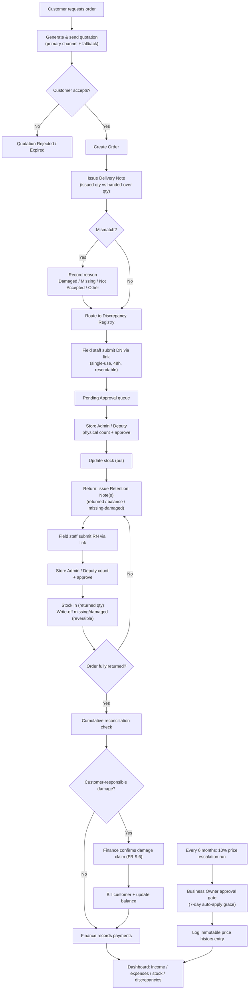
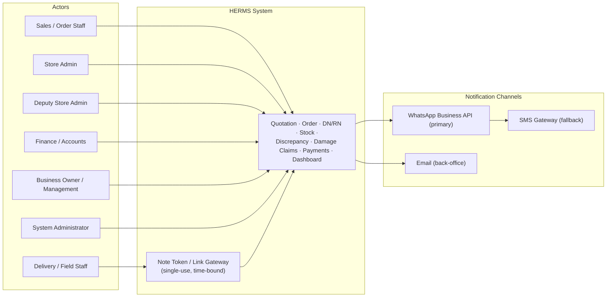

# Hotel Equipment Rental Management System (HERMS)

> [!info] Document Details
> **Document:** Software Requirements Specification
> **Version:** 1.1 — Finalised — Working Version for Architecture Planning
> **Date:** 15 August 2026
> **Prepared by:** Vizualabs (Pvt) Ltd — info@vizualabs.com
>
> > [!warning] Pending Client Sign-off
> > Items in **Section 10.3** still pending client sign-off.

## Revision History

| Version | Date       | Summary of Changes |
|---------|------------|--------------------|
| v1.0    | 11 Aug 2026 | Initial draft SRS submitted for review. |
| v1.1    | 15 Aug 2026 | Finalised working version for architecture planning: resolved caveats/open items from BA review (notification channel strategy, link expiry defaults, pricing cutover rule, damage-claim approval gate, escalation approval gate, discrepancy 'Other' reason, partial-return priority, single-store-now/multi-store-ready data model), and added mitigations for identified single points of failure (Deputy Store Admin role, link resend, discrepancy reversal window, note reopening workflow, price-history immutability, escalation-failure monitoring). Items still needing explicit client sign-off are listed in Section 10.3. |

---

## 1. Introduction

### 1.1 Purpose

This Software Requirements Specification (SRS) defines the functional and non-functional requirements for the **Hotel Equipment Rental Management System (HERMS)** — a system to be built for a business that rents cutlery and crockery (spoons, forks, soup bowls, and related equipment) to hotels and event organisers.

Version 1.1 finalises v1.0 by resolving the caveats, ambiguities, and single points of failure identified during BA review, so that it can serve as the basis for architecture and solution design, development, testing, and delivery.

### 1.2 Document Conventions

> [!note] Naming Conventions
> - **FR-<section>.<n>** — Functional Requirements (e.g., FR-3.1)
> - **BR-<n>** — Business Rules
> - **Priority (MoSCoW):** Must Have (M), Should Have (S), Could Have (C)
> - **Status:** Original · Amended – v1.1 · New – v1.1 (traceable against the v1.0 draft)

### 1.3 Intended Audience

| Audience | Purpose |
|----------|---------|
| Business owner / management | Requirement validation and sign-off |
| Vizualabs project, development, and architecture team | Solution design and implementation |
| Store admin, deputy store admin, sales/order staff, and delivery staff | End users referenced throughout |
| QA team | Test case derivation |

### 1.4 Project Scope

The system digitises the full rental cycle for hotel equipment:

**Quotation → Order Acceptance → Delivery Note Issuance → Retention (Return) Note Processing → Stock & Discrepancy Tracking → Damage Claims → Pricing (incl. automatic periodic escalation) → Payments → Management Reporting (Dashboard).**

> [!tip] v1.1 Decision — Single Store, Multi-Store Ready
> The initial release operates a **single business entity from a single store**. The data model still carries a store/location identifier on all stock and transactional entities from day one (see [[#6.5 Scalability]]), so that multi-store operation is a configuration and data change in a later phase, not a schema redesign.

> [!abstract] Out of Scope (Initial Release)
> - Multi-currency support
> - Integration with third-party accounting software
> - Customer-facing self-service ordering portal (customers place orders via sales staff; a self-service portal is noted as a future enhancement in [[#10.1 Future Enhancements (Out of Initial Scope)]])

### 1.5 Definitions, Acronyms and Abbreviations

| Term | Definition |
|------|------------|
| **Delivery Note (DN)** | Record created when stock is issued from the store and handed over to the customer, capturing quantity issued vs. quantity actually handed over. |
| **Retention Note (RN)** | Record created when equipment is returned by the customer, capturing quantity returned, balance still outstanding, and missing/damaged quantity. |
| **Discrepancy** | Any mismatch between issued, delivered, returned, or balance quantities, recorded with a reason and a responsible party. |
| **Recurring Customer** | A customer with an approved fixed price list applied to all orders. |
| **New Customer** | A customer without a fixed price agreement; pricing is quoted on a custom, per-order basis. |
| **Store Admin** | The role responsible for verifying and accepting equipment counted back into the store and updating stock. |
| **Deputy Store Admin** | A backup role with identical approval authority to Store Admin, designated per store to remove single-person dependency *(new, v1.1)*. |
| **Note Token** | The single-use, time-bound link/token used by field staff to submit a delivery or retention note without a full login *(new entity, v1.1)*. |
| **Responsible Party** | The party (customer or staff member) identified as accountable for a missing or damaged item. |

### 1.6 References

- Business case and process description provided by the client, dated 11 August 2026.
- HERMS SRS v1.0 (11 Aug 2026) and BA Review Notes (13 Aug 2026), superseded/incorporated by this v1.1.
- IEEE 830 / ISO/IEC/IEEE 29148 — general SRS structure conventions used as a template basis.

---

## 2. Overall Description

### 2.1 Product Perspective

HERMS is a **new, standalone business-management system**. It replaces the current manual, paper-based process (physical delivery notes and retention notes) with a digital workflow while preserving the same real-world documents so that existing operational habits are not disrupted. The system centralises stock, orders, payments, and discrepancy data that is today untracked.

### 2.2 Product Functions — Summary

- Quotation generation and delivery to recurring or new customers, using the applicable pricing model
- Order acceptance and system-generated delivery note (store-issued qty vs. handed-over qty, with reasons for any mismatch, including free-text **Other**)
- Retention (return) note processing, including **partial returns**, with cumulative reconciliation
- Field-staff submission of delivery/retention notes via a shared, resendable link, with Store Admin/Deputy count-and-approve before stock updates
- Live stock quantity and stock value tracking, with a bounded, audited correction workflow for confirmed discrepancies
- Missing/damaged item registry with reason, responsible party, and "most missing/damaged item and customer" analysis
- Finance-approved damage claim billing, and Business-Owner-gated automatic **10% price escalation** of equipment every six months
- Payment tracking: pending vs. received payments, monthly income and expenses
- Management dashboard visualising stock, discrepancies, financials, and pending approvals/escalations

### 2.3 User Classes and Characteristics

| User Class | Description / System Interaction |
|------------|----------------------------------|
| **Business Owner / Management** | Views dashboards and reports; no operational data-entry duties; approves pricing rules and pending escalations (FR-9.7). |
| **Sales / Order Staff** | Creates customer records, generates quotations, converts accepted quotations to orders. |
| **Delivery / Field Staff** | Prepares and submits delivery notes at hand-over and retention notes at return, via a resendable link sent to their device. |
| **Store Admin** | Verifies physical counts against submitted delivery/retention notes, approves them, and triggers stock updates. |
| **Deputy Store Admin** *(new, v1.1)* | Identical approval authority to Store Admin; acts as backup when the primary Store Admin is unavailable (FR-7.6). |
| **Finance / Accounts Staff** | Records payments received, tracks pending payments, records expenses, confirms and raises damage claim invoices (FR-9.6). |
| **System Administrator** | Manages users, roles (incl. Deputy Store Admin), permissions, system configuration, link expiry/resend, and correction-window settings. |

### 2.4 Operating Environment

- Web-based application accessible from **desktop browsers** (store/back-office use) and **mobile browsers** (field staff, via shared links).
- Cloud-hosted backend and database with **role-based access control**.
- Notifications delivered via a **primary channel with automatic fallback** (see [[#4.3 Software Interfaces]]).

### 2.5 Design and Implementation Constraints

- Delivery and retention notes must be submitted through a **shareable link** so field staff do not require a full login on personal devices; links default to **single-use, 48-hour expiry**, configurable, with resend/regenerate support (FR-11.1, FR-11.6).
- **No stock quantity may be updated** until a Store Admin or Deputy Store Admin has confirmed a physical count against the submitted note — a mandatory control point.
- Pricing logic must support **two concurrent models**: a fixed price list per recurring customer and an ad-hoc custom price per quotation for new customers, with the cutover rule in FR-1.4.
- Corrections to posted data (stock write-offs, approved notes, price history) must be implemented as **new, audited offsetting entries** rather than in-place edits (FR-6.5, FR-7.7, FR-9.8) — an architecture-level pattern applied consistently across these entities.

### 2.6 Assumptions and Dependencies

- Equipment types (spoons, forks, soup bowls, etc.) are counted in **whole units**; no batch/lot tracking is required.
- The client will confirm the **exact fields** required on printed/PDF delivery and retention notes ([[#10.3 Remaining Open Items — Pending Client Confirmation]]).
- The client will confirm **actual provider accounts** for the notification channels described in [[#4.3 Software Interfaces]] (Section 10.3).

---

## 3. System Features (Functional Requirements)

> [!note] Legend
> Rows **New in v1.1** = New – v1.1 · Rows **Amended from v1.0** = Amended – v1.1 · Unchanged = Original.

### 3.1 Customer & Pricing Management

| ID | Functional Requirement | Priority | Status |
|----|------------------------|----------|--------|
| FR-1.1 | The system shall allow creation and maintenance of customer records, including a customer type of Recurring or New. | M | Original |
| FR-1.2 | For a Recurring customer, the system shall store a fixed price per equipment item that is used automatically on every quotation and order. | M | Original |
| FR-1.3 | For a New customer, the system shall allow sales staff to enter a custom price per item at the time of quotation. | M | Original |
| FR-1.4 | The system shall allow a customer's status to be changed from New to Recurring, at which point a fixed price list is set for that customer. Quotations/orders already accepted before the conversion date retain their original custom pricing; only quotations created after conversion use the new fixed price list. | S | Amended – v1.1 |
| FR-1.5 | The system shall maintain a price history per equipment item, including the reason for each change (e.g., scheduled escalation, negotiated rate). | S | Original |

### 3.2 Quotation Management

| ID | Functional Requirement | Priority | Status |
|----|------------------------|----------|--------|
| FR-2.1 | When a customer requests an order, the system shall generate a quotation listing each equipment item, quantity, applicable unit price (fixed or custom), and total value. | M | Original |
| FR-2.2 | The system shall send the generated quotation to the customer via the configured primary/fallback notification channel (see [[#4.3 Software Interfaces]]). | M | Amended – v1.1 |
| FR-2.3 | The system shall record the quotation status (Sent, Accepted, Rejected, Expired). | M | Original |
| FR-2.4 | On acceptance of a quotation, the system shall allow conversion of the quotation into an order without re-entering line items. | M | Original |

### 3.3 Order & Delivery Note Management

| ID | Functional Requirement | Priority | Status |
|----|------------------------|----------|--------|
| FR-3.1 | On accepting an order, the system shall generate a delivery note recording, per item, the quantity issued from the store and the quantity actually handed over to the customer. | M | Original |
| FR-3.2 | If issued quantity and handed-over quantity do not match for an item, the system shall require a reason to be recorded, selected from: **Damaged, Missing, Not Accepted (by customer), or Other (with mandatory free-text detail)**. | M | Amended – v1.1 |
| FR-3.3 | The system shall route delivery notes with a mismatch to the Discrepancy & Damage Registry ([[#3.5 Discrepancy, Missing & Damage Registry]]) automatically. | M | Original |
| FR-3.4 | The system shall allow the delivery note to be generated as a shareable link for field staff to complete and submit on-site. | M | Original |
| FR-3.5 | The system shall not update stock quantities from a delivery note until it has been approved by a Store Admin or Deputy Store Admin (see [[#3.7 Store Admin Approval Workflow]]). | M | Amended – v1.1 |

### 3.4 Retention (Return) Note Management

| ID | Functional Requirement | Priority | Status |
|----|------------------------|----------|--------|
| FR-4.1 | When equipment is returned, the system shall generate a retention note recording, per item, the quantity retained/returned, the balance still outstanding with the customer, and the missing/damaged quantity. | M | Original |
| FR-4.2 | The system shall validate that, across all retention notes submitted against an order, cumulative returned quantity + balance quantity + missing/damaged quantity equals the original delivered quantity for each item. Full reconciliation is enforced when the order is marked Fully Returned, not on each individual partial note. | M | Amended – v1.1 |
| FR-4.3 | Where the reconciliation in FR-4.2 does not match, the system shall require the discrepancy to be recorded as Missing, Damaged, or Other (free text), along with the responsible party: Customer or Staff Member. | M | Amended – v1.1 |
| FR-4.4 | The system shall allow the retention note to be generated as a shareable link for field staff to complete and submit on return collection. | M | Original |
| FR-4.5 | The system shall not update stock quantities from a retention note until it has been approved by a Store Admin or Deputy Store Admin (see [[#3.7 Store Admin Approval Workflow]]). | M | Amended – v1.1 |
| FR-4.6 | A single order may have multiple partial retention notes (partial returns over time) until the full delivered quantity is accounted for. This is required for launch, not deferred. | M | Amended – v1.1 |
| FR-4.7 | A submitted (not yet approved) retention or delivery note may be corrected by the submitting field staff member up until the point the Store Admin/Deputy begins the approval count; once approval is finalised, correction requires FR-7.7 (reopening). | S | New – v1.1 |

### 3.5 Discrepancy, Missing & Damage Registry

| ID | Functional Requirement | Priority | Status |
|----|------------------------|----------|--------|
| FR-5.1 | The system shall maintain a discrepancy registry capturing: order/customer, item, quantity, discrepancy type (Missing, Damaged, Not Accepted, Other), reason, responsible party, date, and originating note (delivery or retention). | M | Amended – v1.1 |
| FR-5.2 | The dashboard shall display all open missing/damaged records with item, quantity, reason, and responsible party. | M | Original |
| FR-5.3 | The system shall provide a report/view of the most frequently missing or damaged items, ranked by quantity and/or value. | M | Original |
| FR-5.4 | The system shall provide a report/view of the customers most associated with missing or damaged items, ranked by quantity and/or value. | M | Original |
| FR-5.5 | The system shall allow a discrepancy record to be marked as Resolved, Written Off, or Claimed (linked to [[#3.9 Damage Claims & Automatic Price Escalation]]). | S | Original |

### 3.6 Stock Management

| ID | Functional Requirement | Priority | Status |
|----|------------------------|----------|--------|
| FR-6.1 | The system shall maintain a live stock ledger per equipment item, updated only from approved delivery notes (stock out) and approved retention notes (stock in). | M | Original |
| FR-6.2 | The system shall calculate current stock value using the current unit price of each item. | M | Original |
| FR-6.3 | The system shall reduce available stock by quantities recorded as permanently Missing or Damaged (and not returned to usable stock) once a discrepancy is confirmed. | M | Original |
| FR-6.4 | The system shall alert store admins when an item's available stock falls below a configurable reorder threshold. | C | Original |
| FR-6.5 | A confirmed discrepancy write-off may be reversed by a Store Admin within a configurable correction window (default 7 days) with a mandatory reason, restoring the stock; beyond the window, reversal requires a System Administrator override. All reversals are logged as new audit entries, not edits to the original record. | S | New – v1.1 |

### 3.7 Store Admin Approval Workflow

| ID | Functional Requirement | Priority | Status |
|----|------------------------|----------|--------|
| FR-7.1 | When a staff member submits a delivery note or retention note via link, the system shall place it in a Pending Approval queue visible to the assigned Store Admin and any Deputy Store Admin(s) for that store. | M | Amended – v1.1 |
| FR-7.2 | The Store Admin (or Deputy) shall physically count the equipment handed over to the store and enter the counted quantity against the submitted note. | M | Amended – v1.1 |
| FR-7.3 | If the counted quantity differs from the submitted note, the system shall flag the difference for review before final approval. | M | Original |
| FR-7.4 | Only after Store Admin/Deputy approval shall the system update stock quantities and close the note. | M | Amended – v1.1 |
| FR-7.5 | The system shall keep a full audit trail of who submitted, who approved, and any adjustments made during approval. | S | Original |
| FR-7.6 | A System Administrator may designate one or more Deputy Store Admins per store, holding identical approval permissions to the primary Store Admin, to remove single-person dependency on the approval step. | M | New – v1.1 |
| FR-7.7 | An already-approved note may only be reopened by a System Administrator. Reopening creates a new correction entry (with reason) that reverses and re-applies the relevant stock movement; the original approval record remains visible, unedited, in the audit trail. | S | New – v1.1 |

### 3.8 Payment & Invoicing Management

| ID | Functional Requirement | Priority | Status |
|----|------------------------|----------|--------|
| FR-8.1 | The system shall generate an invoice value per order based on the quotation/order pricing. | M | Original |
| FR-8.2 | The system shall record payments received against an order/invoice, including partial payments. | M | Original |
| FR-8.3 | The system shall calculate and display pending (outstanding) payment balance per customer and per order. | M | Original |
| FR-8.4 | The system shall record business expenses (category, amount, date, description) independent of customer orders. | M | Original |
| FR-8.5 | The system shall calculate monthly income (payments received) and monthly expenses, and the resulting net position. | M | Original |

### 3.9 Damage Claims & Automatic Price Escalation

| ID | Functional Requirement | Priority | Status |
|----|------------------------|----------|--------|
| FR-9.1 | Where a discrepancy is marked Damaged with responsible party Customer, the system shall allow a damage claim to be raised, billing the customer at the item's current unit price. | M | Original |
| FR-9.2 | A raised damage claim shall be added to the customer's outstanding balance and reflected in pending payments once confirmed (see FR-9.6). | M | Amended – v1.1 |
| FR-9.3 | The system shall automatically increase each equipment item's unit price by 10% every six months from a configurable effective date, subject to the approval gate in FR-9.7. | M | Amended – v1.1 |
| FR-9.4 | Each price escalation shall be logged in the price history (see FR-1.5) with the effective date and previous/new price. | M | Original |
| FR-9.5 | Damage claims raised after an escalation date shall use the price in effect on the date the damage was recorded, not a later or earlier price. | S | Original |
| FR-9.6 | Before a damage claim raised under FR-9.1 is added to the customer's outstanding balance, it shall require review and confirmation by a Finance/Accounts user. | M | New – v1.1 |
| FR-9.7 | Each scheduled price escalation shall first appear to Business Owner/Management as a pending action on the dashboard; if not explicitly approved or rejected within a configurable grace period (default 7 days), it applies automatically so pricing is never indefinitely stalled. | M | New – v1.1 |
| FR-9.8 | Price history entries shall be immutable once written; any correction shall be made via a new offsetting entry, never an in-place edit. | M | New – v1.1 |
| FR-9.9 | The system shall alert the System Administrator if a scheduled price escalation run fails to execute as configured. | S | New – v1.1 |

### 3.10 Dashboard & Reporting

| ID | Functional Requirement | Priority | Status |
|----|------------------------|----------|--------|
| FR-10.1 | The dashboard shall display current stock quantity and stock value by item. | M | Original |
| FR-10.2 | The dashboard shall display total pending payments and total received payments for the current month, with trend over prior months. | M | Original |
| FR-10.3 | The dashboard shall display monthly income vs. monthly expenses, with net income/loss. | M | Original |
| FR-10.4 | The dashboard shall display damaged/missing items, their value, reason, and responsible party, filterable by date range, customer, and item. | M | Original |
| FR-10.5 | The dashboard shall display the most missing/damaged items and the associated customers (from FR-5.3/FR-5.4). | M | Original |
| FR-10.6 | Reports shall be exportable (e.g., to PDF/Excel) for offline sharing. | S | Original |
| FR-10.7 | The dashboard shall display any pending price escalation actions awaiting Business Owner/Management confirmation (see FR-9.7). | S | New – v1.1 |

### 3.11 Notification & Link-Based Note Submission

| ID | Functional Requirement | Priority | Status |
|----|------------------------|----------|--------|
| FR-11.1 | The system shall generate a unique, time-bound link for each delivery note and retention note, sent to the assigned staff member. Default: single-use, 48-hour expiry, whichever occurs first; configurable by System Administrator. | M | Amended – v1.1 |
| FR-11.2 | The link shall open a mobile-friendly form pre-filled with the order's items, allowing the staff member to enter actual quantities and reasons. | M | Original |
| FR-11.3 | On submission via the link, the note shall move to the Pending Approval queue (see [[#3.7 Store Admin Approval Workflow]]). | M | Original |
| FR-11.4 | The system shall notify the Store Admin/Deputy when a note is awaiting approval, and notify sales/finance staff when a note is approved. | S | Amended – v1.1 |
| FR-11.5 | If delivery via the primary notification channel fails, the system shall automatically retry via the configured fallback channel (see [[#4.3 Software Interfaces]]) before flagging the notification as failed. | M | New – v1.1 |
| FR-11.6 | A Store Admin or Sales staff member shall be able to resend or regenerate a note-submission link (e.g., if lost or expired); each resend is logged with the authorising user. | M | New – v1.1 |

### 3.12 User & Role Management

| ID | Functional Requirement | Priority | Status |
|----|------------------------|----------|--------|
| FR-12.1 | The system shall support role-based access control for Business Owner, Sales/Order Staff, Delivery/Field Staff, Store Admin, Deputy Store Admin, Finance/Accounts, and System Administrator roles. | M | Amended – v1.1 |
| FR-12.2 | Field staff shall be able to submit notes via link without requiring a full system login. | M | Original |
| FR-12.3 | All financial and stock-affecting actions shall be attributable to an authenticated user or verified link token. | M | Original |
| FR-12.4 | A System Administrator shall be able to designate one or more Deputy Store Admins per store, with the same permissions as a Store Admin (see FR-7.6). | M | New – v1.1 |

---

## 4. External Interface Requirements

### 4.1 User Interfaces

- Back-office web application (desktop-first) for sales, store admin, finance, and management.
- Mobile-responsive link-based forms for delivery note and retention note submission by field staff.
- Dashboard views optimised for both desktop and tablet, including pending-approval and pending-escalation widgets.

### 4.2 Hardware Interfaces

No specialised hardware is required for the initial release. Barcode/RFID scanning for equipment counting is a future enhancement ([[#10.1 Future Enhancements (Out of Initial Scope)]]).

### 4.3 Software Interfaces

> [!tip] v1.1 Decision — Notification Strategy
> **Primary:** WhatsApp Business API · **Automatic fallback:** SMS gateway (if WhatsApp delivery fails — FR-11.5) · **Email** available for back-office notifications.
>
> This removes the single-provider dependency flagged in review; exact provider accounts still need client confirmation ([[#10.3 Remaining Open Items — Pending Client Confirmation]]).

- Optional future integration with accounting software for exporting income/expense data.

### 4.4 Communication Interfaces

- All client-server communication shall use **HTTPS**.
- Shareable note links are **single-use, time-bound tokens** (default 48 hours, configurable) to prevent unauthorised access, with authorised resend/regeneration per FR-11.6.

---

## 5. Data Requirements

### 5.1 Key Data Entities

| Entity | Key Attributes (indicative) |
|--------|-----------------------------|
| **Customer** | Name, type (Recurring/New), contact details, fixed price list (if recurring), outstanding balance |
| **Equipment Item** | Name, category, current unit price, price history, current stock qty, unit of measure |
| **Quotation** | Customer, items & quantities, unit price used, total value, status, date |
| **Order** | Linked quotation, customer, status, associated delivery/retention notes |
| **Delivery Note** | Order, item lines (issued qty, handed-over qty, reason if mismatched, incl. Other + free text), submitted-by, approved-by (Store Admin/Deputy), status |
| **Retention Note** | Order/delivery note reference, item lines (returned qty, balance qty, missing/damaged qty, reason, responsible party), submitted-by, approved-by, status, correction history (FR-4.7) |
| **Discrepancy Record** | Source note, item, type (missing/damaged/not accepted/other), reason, responsible party, value, resolution status, reversed-by/reversed-date (FR-6.5) |
| **Payment** | Order/customer, amount, date, method, remaining balance |
| **Expense** | Category, amount, date, description |
| **Price History** | Item, old price, new price, effective date, reason (escalation/negotiated), immutable/append-only (FR-9.8) |
| **Escalation Run** *(new, v1.1)* | Effective date, status (Pending Approval / Approved / Auto-Applied / Failed), approved-by, approved-date (FR-9.7, FR-9.9) |
| **Note Token** *(new, v1.1)* | Token, note reference, issued-to, expiry, status (Active/Used/Expired), resend count, resent-by (FR-11.1, FR-11.6) |
| **User** | Name, role (incl. Deputy Store Admin), assigned store(s), contact, credentials/access token |

### 5.2 Data Retention

Transactional records (quotations, notes, payments, discrepancies, price history, escalation runs, note tokens) shall be retained **indefinitely** to support historical reporting and audit, unless the client specifies a different retention policy. Corrective entries ([[#2.5 Design and Implementation Constraints]]) are retained **alongside — never in place of —** the records they correct.

---

## 6. Non-Functional Requirements

### 6.1 Performance

Dashboard views shall load within **3 seconds** under normal load for a data set of up to several years of transactions.

### 6.2 Security

- Role-based access control shall restrict data and actions to authorised roles ([[#3.12 User & Role Management]]), including the Deputy Store Admin role.
- Note-submission links shall expire after a configurable period and shall not expose data beyond the specific order; resend/regeneration actions are logged with the authorising user (FR-11.6).
- All financial data changes shall be logged with user, timestamp, and before/after values.

### 6.3 Availability & Reliability

- The system shall target **99.5% uptime** for the back-office and dashboard modules.
- Stock quantities shall **never be updated without a corresponding approved note** (FR-3.5/FR-4.5).
- The Store Admin approval bottleneck identified in review is mitigated via the Deputy Store Admin role (FR-7.6/FR-12.4).

### 6.4 Usability

Link-based note forms shall be completable on a mobile device in **under 2 minutes** for a typical order.

### 6.5 Scalability

The data model shall carry a **store/location identifier** on all stock and transactional entities from the initial release, even under single-store operation, so that multi-store/branch support ([[#1.4 Project Scope]]) is a data and configuration change rather than a schema redesign.

### 6.6 Auditability

- Every stock movement, price change, discrepancy, and payment shall be traceable to a source document and user.
- All corrective actions (discrepancy reversal FR-6.5, note reopening FR-7.7, price-history offsetting entries FR-9.8) shall be recorded as **new, timestamped entries** rather than edits to existing records, preserving full history.

### 6.7 Monitoring & Operability *(new, v1.1)*

The system shall alert System Administrators on failure of scheduled jobs, including price escalation runs (FR-9.9) and repeated notification-channel failures (FR-11.5).

---

## 7. Business Rules

| ID | Business Rule |
|----|---------------|
| **BR-1** *(Amended)* | Recurring customers are always priced using their stored fixed price list; new customers are priced using a custom price entered per quotation. A change of pricing model applies only to quotations created after the change (FR-1.4). |
| **BR-2** *(Amended)* | Any mismatch between store-issued quantity and customer-handed-over quantity at delivery must be recorded with a reason: Damaged, Missing, Not Accepted, or Other (free text). |
| **BR-3** *(Amended)* | At return, returned qty + balance qty + missing/damaged qty must reconcile to the original delivered qty across all retention notes for the order; any shortfall must be recorded as Missing, Damaged, or Other, with a responsible party (Customer or Staff Member). |
| **BR-4** *(Amended)* | No stock quantity is updated in the system until a Store Admin or Deputy Store Admin has physically counted and approved the corresponding delivery or retention note. |
| **BR-5** *(Amended)* | A damage claim may be billed to a customer only where the discrepancy's responsible party is Customer, and only after Finance/Accounts confirmation (FR-9.6). |
| **BR-6** *(Amended)* | Each equipment item's unit price automatically increases by 10% every six months, subject to Business Owner approval or the auto-apply grace period (FR-9.7); damage claims use the price in effect on the date of the damage record. |
| **BR-7** *(New)* | A Deputy Store Admin has identical approval authority to the primary Store Admin and may act in their absence (FR-7.6). |
| **BR-8** *(New)* | Confirmed discrepancies may be reversed only within the configured correction window (default 7 days) by a Store Admin, or at any time by a System Administrator (FR-6.5). |
| **BR-9** *(New)* | An approved delivery or retention note may only be reopened by a System Administrator; reopening creates a new audit entry rather than editing history (FR-7.7). |
| **BR-10** *(New)* | Price history entries are append-only; corrections are made via new offsetting entries, never in-place edits (FR-9.8). |

---

## 8. Process Workflow Overview

The end-to-end process flow implemented by the system, updated for v1.1 decisions:

1. Customer requests an order → system generates and sends a quotation via the primary notification channel, with automatic fallback (FR-11.5), using the applicable pricing model.
2. Customer accepts the quotation → order is created.
3. Order is fulfilled: a delivery note is issued, capturing store-issued qty and customer-handed-over qty; any mismatch is recorded with a reason (incl. Other).
4. Field staff submit the delivery note via link (resendable if lost/expired) → Store Admin or Deputy counts and approves → stock is reduced.
5. At the end of the rental period, equipment is collected/returned: one or more retention notes are issued (partial returns supported), capturing returned qty, balance qty, and missing/damaged qty with reason and responsible party.
6. Field staff submit each retention note via link → Store Admin or Deputy counts and approves → stock is increased by returned qty; confirmed missing/damaged qty is written off from usable stock (reversible within the correction window, FR-6.5). Full reconciliation is checked once the order is marked Fully Returned.
7. Confirmed customer-responsible damage is reviewed and confirmed by Finance/Accounts (FR-9.6) before being billed as a damage claim and added to the customer's outstanding balance.
8. Finance records payments against outstanding balances; pending and received payments, income, and expenses are visualised on the dashboard.
9. Every six months, a price escalation run is proposed to Business Owner/Management for approval; if not actioned within the grace period, it applies automatically (FR-9.7), and is logged as an immutable price history entry (FR-9.8).

---

## 9. Dashboard & Reporting Requirements Summary

| Dashboard View | Source Requirement(s) |
|----------------|-----------------------|
| Stock quantity & stock value by item | FR-6.1, FR-6.2, FR-10.1 |
| Open missing/damaged items — item, qty, reason, responsible party | FR-5.2, FR-10.4 |
| Most missing/damaged items (ranked) | FR-5.3, FR-10.5 |
| Customers most associated with missing/damaged items (ranked) | FR-5.4, FR-10.5 |
| Pending payments vs. received payments (monthly, with trend) | FR-8.3, FR-10.2 |
| Monthly income vs. monthly expenses (with net position) | FR-8.4, FR-8.5, FR-10.3 |
| Pending price escalation approvals awaiting Business Owner action | FR-9.7, FR-10.7 *(new, v1.1)* |

---

## 10. Assumptions, Constraints, Decisions & Open Items

### 10.1 Future Enhancements (Out of Initial Scope)

- Customer-facing self-service ordering portal.
- Barcode/RFID-based equipment counting to reduce manual counting error.
- Multi-branch/multi-store stock consolidation (data model is prepared for this from day one, per [[#6.5 Scalability]]).
- Direct accounting-software integration.

### 10.2 Resolved Decisions (v1.1)

The following were open items or caveats identified during BA review of v1.0. They have been resolved below as working decisions to unblock architecture planning; each remains open to override by the client during sign-off.

| # | Decision |
|---|----------|
| 1 | **Notification channel:** primary WhatsApp Business API, automatic SMS fallback, email for back-office ([[#4.3 Software Interfaces]]). |
| 2 | **Note-link security:** single-use, 48-hour default expiry, with authorised resend/regeneration (FR-11.1, FR-11.6). |
| 3 | **Pricing model cutover** on New→Recurring conversion: only future quotations use the new fixed price (FR-1.4). |
| 4 | **Price escalation:** Business-Owner approval gate with a 7-day auto-apply grace period (FR-9.7). |
| 5 | **Damage claims:** mandatory Finance/Accounts confirmation before billing (FR-9.6). |
| 6 | **Partial retention notes:** upgraded to Must Have; reconciliation checked cumulatively at Fully Returned status, not per partial note (FR-4.2, FR-4.6). |
| 7 | **Discrepancy reason lists:** 'Other' with mandatory free text added to both delivery and retention discrepancy categories (FR-3.2, FR-4.3). |
| 8 | **Single-store vs multi-store:** initial release is single-store; data model carries store_id throughout from day one ([[#6.5 Scalability]]). |
| 9 | **Store Admin bottleneck:** mitigated via new Deputy Store Admin role with identical approval rights (FR-7.6, FR-12.4). |
| 10 | **Post-approval corrections:** reopening restricted to System Administrator, implemented as new audit entries, never edits (FR-7.7). |
| 11 | **Discrepancy write-off correction:** reversible within a default 7-day window by Store Admin, or any time by System Administrator (FR-6.5). |

### 10.3 Remaining Open Items — Pending Client Confirmation

> [!warning] Still Open — Needs Client Confirmation
> - **Exact printed/PDF layout** required for delivery notes and retention notes, to match existing paper formats used with hotels.
> - **Actual provider/account details** for the chosen notification channels (WhatsApp Business API, SMS gateway) — Vizualabs has proposed the strategy in [[#4.3 Software Interfaces]], but account provisioning is the client's responsibility.
> - **Number and identity of Deputy Store Admins** per store.
> - Whether the default **7-day discrepancy-correction window** and **7-day escalation-approval grace period** are acceptable, or should be a different duration.
> - Whether the business anticipates ever operating as **more than one legal business entity** (affects whether tenant-level isolation should be planned for, beyond the multi-store readiness already scoped).

---

## 11. Appendix

### 11.1 Sample Delivery Note — Fields

- Order/Delivery Note number and date
- Customer name and delivery location
- Per item: quantity issued from store, quantity handed over to customer, mismatch reason if any (Damaged / Missing / Not Accepted / Other + detail)
- Issued-by (staff), approved-by (Store Admin or Deputy), approval date

### 11.2 Sample Retention Note — Fields

- Retention Note number and date, linked delivery note/order
- Per item: quantity returned, balance outstanding, missing/damaged quantity, reason (incl. Other + detail), responsible party
- Submitted-by (staff), approved-by (Store Admin or Deputy), approval date

### 11.3 Document Sign-off

| Role | Name / Signature / Date |
|------|-------------------------|
| Business Owner | |
| Vizualabs Project Lead | Yesith-sri |
