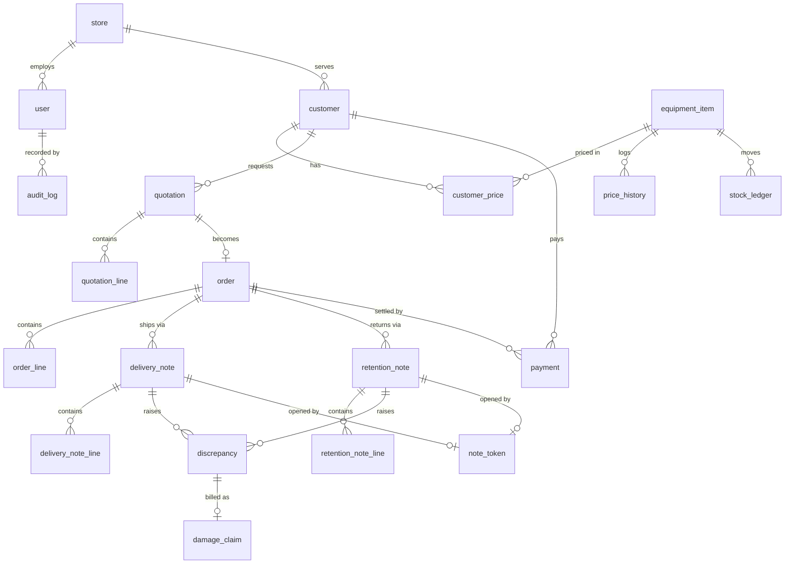

# HERMS Database Schema

The database is **Neon PostgreSQL**, managed with **Drizzle** migrations that are checked into git and run forward-only as a gated CI step (never auto-applied on Lambda cold start).

This document is the authoritative schema reference. An agent generating Drizzle models or migrations should translate the tables below directly — do not invent columns, names, or relationships beyond what is written here.

## Conventions

| Rule | Value |
|---|---|
| Primary keys | `uuid` with `default gen_random_uuid()` |
| Money | `integer` minor units (cents), column suffix `_cents` (I-10) |
| Quantities | `integer` whole units (no batch/lot tracking) |
| Timestamps | `timestamptz`, default `now()` |
| Naming | `snake_case`; line tables named `<parent>_line` |
| Soft delete | Not used; corrections are new rows, never in-place edits |
| Enforced append-only | `price_history`, `stock_ledger`, `audit_log` (see Triggers) |

## Driver

Use Neon's **HTTP/serverless driver** — no classic pooled `pg` connection per invocation. Locked in Phase 0 (see [Architecture Risks](../roadmap/architecture-risks.md)).

## Enums

| Enum | Values |
|---|---|
| `user_role` | `business_owner`, `sales`, `field_staff`, `store_admin`, `finance`, `system_admin` |
| `customer_type` | `recurring`, `new` |
| `quotation_status` | `sent`, `accepted`, `rejected`, `expired` |
| `order_status` | `open`, `fully_returned`, `cancelled` |
| `note_status` | `draft`, `submitted`, `pending_approval`, `approved`, `rejected`, `reopened` |
| `discrepancy_type` | `missing`, `damaged`, `not_accepted`, `other` |
| `discrepancy_status` | `open`, `resolved`, `written_off`, `claimed` |
| `responsible_party` | `customer`, `staff_member` |
| `price_change_reason` | `scheduled_escalation`, `negotiated`, `correction` |
| `stock_direction` | `in`, `out`, `write_off` |
| `payment_method` | `cash`, `bank_transfer`, `cheque`, `other` |
| `audit_actor_type` | `user`, `token` |
| `outbox_status` | `pending`, `published`, `failed` |
| `token_status` | `active`, `used`, `revoked` |
| `claim_status` | `drafted`, `confirmed`, `rejected` |

---

## Tables

### store

Business store/branch (multi-store-ready per §6.5, not built out in v1).

| Column | Type | Notes |
|---|---|---|
| `id` | uuid PK | |
| `name` | text NOT NULL | |
| `address` | text NULL | |
| `created_at` | timestamptz | default now() |

### user

The six SRS roles (§2.3). Field staff may submit via token without a login, so `password_hash` is nullable.

| Column | Type | Notes |
|---|---|---|
| `id` | uuid PK | |
| `store_id` | uuid FK → `store.id` | NULL for owner/system admin |
| `name` | text NOT NULL | |
| `role` | `user_role` NOT NULL | |
| `is_deputy_admin` | boolean NOT NULL default false | Deputy Store Admin for the store |
| `phone` | text NULL | |
| `email` | text NULL, UNIQUE where not null | |
| `password_hash` | text NULL | NULL for token-only field staff |
| `active` | boolean NOT NULL default true | |
| `created_at`, `updated_at` | timestamptz | |

### customer

Customer master (FR-1.1).

| Column | Type | Notes |
|---|---|---|
| `id` | uuid PK | |
| `store_id` | uuid FK → `store.id` | |
| `name` | text NOT NULL | |
| `type` | `customer_type` NOT NULL default `new` | FR-1.1 |
| `phone` | text NULL | |
| `email` | text NULL | |
| `address` | text NULL | |
| `outstanding_balance_cents` | integer NOT NULL default 0 | Denormalized; updated transactionally on payment/claim confirm |
| `created_at`, `updated_at` | timestamptz | |

### customer_price

Fixed price list per recurring customer (FR-1.2, BR-1, I-7).

| Column | Type | Notes |
|---|---|---|
| `id` | uuid PK | |
| `customer_id` | uuid FK → `customer.id` NOT NULL, ON DELETE CASCADE | |
| `equipment_item_id` | uuid FK → `equipment_item.id` NOT NULL | |
| `unit_price_cents` | integer NOT NULL | |
| `effective_from` | timestamptz NOT NULL default now() | |
| `effective_to` | timestamptz NULL | NULL = current price |
| `created_at` | timestamptz | |

Unique on `(customer_id, equipment_item_id, effective_from)`.

### equipment_item

Equipment master (FR-1.x).

| Column | Type | Notes |
|---|---|---|
| `id` | uuid PK | |
| `name` | text NOT NULL | |
| `category` | text NOT NULL | |
| `unit_of_measure` | text NOT NULL default `unit` | |
| `current_unit_price_cents` | integer NOT NULL | Cached latest price; truth lives in `price_history` |
| `reorder_threshold` | integer NULL | FR-6.4 |
| `created_at`, `updated_at` | timestamptz | |

### price_history  (append-only)

Immutable price log (FR-1.5, FR-9.7, I-3). Point-in-time source for claims (I-4).

| Column | Type | Notes |
|---|---|---|
| `id` | uuid PK | |
| `equipment_item_id` | uuid FK → `equipment_item.id` NOT NULL | |
| `old_price_cents` | integer NULL | NULL on the opening price |
| `new_price_cents` | integer NOT NULL | |
| `effective_date` | timestamptz NOT NULL | |
| `reason` | `price_change_reason` NOT NULL | |
| `created_by` | uuid FK → `user.id` NULL | |
| `created_at` | timestamptz default now() | |

Trigger rejects `UPDATE`/`DELETE` (I-3). Index on `(equipment_item_id, effective_date)`.

### quotation

Quotation header (FR-2.1, FR-2.3).

| Column | Type | Notes |
|---|---|---|
| `id` | uuid PK | |
| `quotation_number` | text NOT NULL UNIQUE | |
| `customer_id` | uuid FK → `customer.id` NOT NULL | |
| `status` | `quotation_status` NOT NULL default `sent` | |
| `total_value_cents` | integer NOT NULL default 0 | |
| `created_by` | uuid FK → `user.id` NULL | |
| `created_at` | timestamptz default now() | |
| `sent_at` | timestamptz NULL | |
| `expires_at` | timestamptz NULL | |
| `updated_at` | timestamptz | |

### quotation_line

Line items with frozen prices (I-11).

| Column | Type | Notes |
|---|---|---|
| `id` | uuid PK | |
| `quotation_id` | uuid FK → `quotation.id` NOT NULL, ON DELETE CASCADE | |
| `equipment_item_id` | uuid FK → `equipment_item.id` NOT NULL | |
| `quantity` | integer NOT NULL CHECK (> 0) | |
| `unit_price_cents` | integer NOT NULL | Frozen at creation (I-11) |
| `line_total_cents` | integer NOT NULL | `quantity * unit_price_cents` |

### order

Order header (FR-2.4).

| Column | Type | Notes |
|---|---|---|
| `id` | uuid PK | |
| `order_number` | text NOT NULL UNIQUE | |
| `quotation_id` | uuid FK → `quotation.id` UNIQUE NULL | Accepted quotation |
| `customer_id` | uuid FK → `customer.id` NOT NULL | |
| `status` | `order_status` NOT NULL default `open` | `fully_returned` closes reconciliation (I-6) |
| `total_value_cents` | integer NOT NULL default 0 | |
| `created_by` | uuid FK → `user.id` NULL | |
| `created_at`, `updated_at` | timestamptz | |

### order_line

| Column | Type | Notes |
|---|---|---|
| `id` | uuid PK | |
| `order_id` | uuid FK → `order.id` NOT NULL, ON DELETE CASCADE | |
| `equipment_item_id` | uuid FK → `equipment_item.id` NOT NULL | |
| `quantity` | integer NOT NULL CHECK (> 0) | |
| `unit_price_cents` | integer NOT NULL | Frozen from quotation (I-11) |
| `line_total_cents` | integer NOT NULL | |

### delivery_note

Delivery Note (FR-3.1). `store_id` denormalized for the approval queue.

| Column | Type | Notes |
|---|---|---|
| `id` | uuid PK | |
| `dn_number` | text NOT NULL UNIQUE | |
| `order_id` | uuid FK → `order.id` NOT NULL | |
| `store_id` | uuid FK → `store.id` NULL | For queue scoping |
| `status` | `note_status` NOT NULL default `draft` | |
| `submitted_by` | uuid FK → `user.id` NULL | |
| `approved_by` | uuid FK → `user.id` NULL | |
| `submitted_at` | timestamptz NULL | |
| `approved_at` | timestamptz NULL | |
| `created_at`, `updated_at` | timestamptz | |

### delivery_note_line

Per line: issued vs handed-over (FR-3.1, FR-3.2).

| Column | Type | Notes |
|---|---|---|
| `id` | uuid PK | |
| `delivery_note_id` | uuid FK → `delivery_note.id` NOT NULL, ON DELETE CASCADE | |
| `equipment_item_id` | uuid FK → `equipment_item.id` NOT NULL | |
| `issued_qty` | integer NOT NULL CHECK (>= 0) | |
| `handed_over_qty` | integer NOT NULL CHECK (>= 0) | |
| `mismatch_reason` | `discrepancy_type` NULL | Required when issued ≠ handed (BR-2) |
| `mismatch_detail` | text NULL | Required when `mismatch_reason = other` |

CHECK: `issued_qty = handed_over_qty` OR `mismatch_reason IS NOT NULL`.

### retention_note

Retention Note (FR-4.1).

| Column | Type | Notes |
|---|---|---|
| `id` | uuid PK | |
| `rn_number` | text NOT NULL UNIQUE | |
| `order_id` | uuid FK → `order.id` NOT NULL | |
| `delivery_note_id` | uuid FK → `delivery_note.id` NULL | Linked delivery |
| `store_id` | uuid FK → `store.id` NULL | |
| `status` | `note_status` NOT NULL default `draft` | |
| `submitted_by` | uuid FK → `user.id` NULL | |
| `approved_by` | uuid FK → `user.id` NULL | |
| `submitted_at`, `approved_at` | timestamptz NULL | |
| `created_at`, `updated_at` | timestamptz | |

### retention_note_line

Per line: returned / balance / missing-damaged (FR-4.1, FR-4.3).

| Column | Type | Notes |
|---|---|---|
| `id` | uuid PK | |
| `retention_note_id` | uuid FK → `retention_note.id` NOT NULL, ON DELETE CASCADE | |
| `equipment_item_id` | uuid FK → `equipment_item.id` NOT NULL | |
| `returned_qty` | integer NOT NULL CHECK (>= 0) | |
| `balance_qty` | integer NOT NULL CHECK (>= 0) | |
| `missing_damaged_qty` | integer NOT NULL CHECK (>= 0) | |
| `mismatch_reason` | `discrepancy_type` NULL | `missing` / `damaged` / `other` |
| `responsible_party` | `responsible_party` NULL | Required on shortfall (BR-3); determines billability (BR-5) |
| `reason_detail` | text NULL | |

### stock_ledger  (append-only)

Append-only stock movements (FR-6.1, I-1). Inserted only inside the approval transaction; current quantity is derived by summing this table.

| Column | Type | Notes |
|---|---|---|
| `id` | uuid PK | |
| `equipment_item_id` | uuid FK → `equipment_item.id` NOT NULL | |
| `store_id` | uuid FK → `store.id` NULL | |
| `source_type` | text NOT NULL | `delivery_note` \| `retention_note` \| `opening_balance` |
| `source_note_id` | uuid NOT NULL | ID of the approved note (or opening-balance note) |
| `direction` | `stock_direction` NOT NULL | `in` / `out` / `write_off` |
| `quantity_delta` | integer NOT NULL | Signed: positive `in`, negative `out`/`write_off` |
| `created_by` | uuid FK → `user.id` NULL | Approving admin |
| `created_at` | timestamptz default now() | |

Trigger rejects `UPDATE`/`DELETE` (I-1). Index on `(equipment_item_id, created_at)`.

### discrepancy

Discrepancy registry (FR-5.1).

| Column | Type | Notes |
|---|---|---|
| `id` | uuid PK | |
| `source_type` | text NOT NULL | `delivery_note` \| `retention_note` |
| `source_note_id` | uuid NOT NULL | |
| `source_line_id` | uuid NULL | Producing line |
| `order_id` | uuid FK → `order.id` NULL | |
| `equipment_item_id` | uuid FK → `equipment_item.id` NOT NULL | |
| `quantity` | integer NOT NULL CHECK (> 0) | |
| `discrepancy_type` | `discrepancy_type` NOT NULL | |
| `reason` | text NULL | |
| `responsible_party` | `responsible_party` NULL | Required for claims (BR-5) |
| `value_cents` | integer NOT NULL default 0 | Computed at price-at-date |
| `status` | `discrepancy_status` NOT NULL default `open` | |
| `created_at`, `resolved_at`, `updated_at` | timestamptz | |

### damage_claim

Damage claim (FR-9.1–9.6). One per discrepancy.

| Column | Type | Notes |
|---|---|---|
| `id` | uuid PK | |
| `discrepancy_id` | uuid FK → `discrepancy.id` NOT NULL UNIQUE | |
| `order_id` | uuid FK → `order.id` NULL | |
| `customer_id` | uuid FK → `customer.id` NOT NULL | |
| `equipment_item_id` | uuid FK → `equipment_item.id` NOT NULL | |
| `quantity` | integer NOT NULL | |
| `unit_price_cents` | integer NOT NULL | Price at damage date (I-4) |
| `claim_amount_cents` | integer NOT NULL | |
| `status` | `claim_status` NOT NULL default `drafted` | Finance confirms → `confirmed` (I-5) |
| `confirmed_by` | uuid FK → `user.id` NULL | Finance user |
| `confirmed_at` | timestamptz NULL | |
| `created_at`, `updated_at` | timestamptz | |

App-level rule: `discrepancy.responsible_party = customer` before a claim is draftable (I-5).

### payment  (append-only)

Payments (FR-8.2). Corrections are reversal payments, not edits.

| Column | Type | Notes |
|---|---|---|
| `id` | uuid PK | |
| `order_id` | uuid FK → `order.id` NOT NULL | |
| `customer_id` | uuid FK → `customer.id` NOT NULL | |
| `amount_cents` | integer NOT NULL CHECK (> 0) | |
| `payment_date` | timestamptz NOT NULL | |
| `method` | `payment_method` NOT NULL | |
| `created_by` | uuid FK → `user.id` NULL | |
| `created_at` | timestamptz default now() | |

### expense

Expenses (FR-8.4).

| Column | Type | Notes |
|---|---|---|
| `id` | uuid PK | |
| `category` | text NOT NULL | |
| `amount_cents` | integer NOT NULL CHECK (> 0) | |
| `expense_date` | timestamptz NOT NULL | |
| `description` | text NULL | |
| `created_by` | uuid FK → `user.id` NULL | |
| `created_at` | timestamptz default now() | |

### audit_log  (append-only)

Audit trail (FR-7.5, I-8, §6.2, §6.6).

| Column | Type | Notes |
|---|---|---|
| `id` | uuid PK | |
| `actor_type` | `audit_actor_type` NOT NULL | `user` \| `token` |
| `actor_id` | uuid NULL | user id or token id |
| `action` | text NOT NULL | |
| `entity_type` | text NOT NULL | |
| `entity_id` | uuid NULL | |
| `before` | jsonb NULL | |
| `after` | jsonb NULL | |
| `request_id` | text NULL | correlation ID |
| `created_at` | timestamptz default now() | |

Trigger rejects `UPDATE`/`DELETE` (I-8).

### outbox

Notification intents (I-12). Written in the same transaction as the business change.

| Column | Type | Notes |
|---|---|---|
| `id` | uuid PK | |
| `event_type` | text NOT NULL | |
| `aggregate_type` | text NOT NULL | |
| `aggregate_id` | uuid NOT NULL | |
| `payload` | jsonb NOT NULL | |
| `idempotency_key` | text NOT NULL UNIQUE | |
| `status` | `outbox_status` NOT NULL default `pending` | |
| `attempts` | integer NOT NULL default 0 | |
| `available_at` | timestamptz NOT NULL default now() | |
| `published_at` | timestamptz NULL | |
| `created_at` | timestamptz default now() | |

Index on `(status, available_at)`.

### note_token

Scoped, expiring link token (FR-11.1, FR-12.2, I-9). Store the hash, never the raw token.

| Column | Type | Notes |
|---|---|---|
| `id` | uuid PK | |
| `token_hash` | text NOT NULL UNIQUE | SHA-256 of the raw token |
| `note_type` | text NOT NULL | `delivery_note` \| `retention_note` |
| `note_id` | uuid NOT NULL | The note this token opens |
| `status` | `token_status` NOT NULL default `active` | |
| `expires_at` | timestamptz NOT NULL | Checked at read time (I-9) |
| `used_at` | timestamptz NULL | |
| `created_by` | uuid FK → `user.id` NULL | |
| `created_at` | timestamptz default now() | |

---

## Relationships

| From | To | Cardinality | Note |
|---|---|---|---|
| `store` | `user` | 1—N | store staff |
| `store` | `customer` | 1—N | |
| `customer` | `customer_price` | 1—N | fixed price list |
| `customer_price` | `equipment_item` | N—1 | |
| `equipment_item` | `price_history` | 1—N | immutable log |
| `equipment_item` | `stock_ledger` | 1—N | append-only |
| `customer` | `quotation` | 1—N | |
| `quotation` | `quotation_line` | 1—N | |
| `quotation_line` | `equipment_item` | N—1 | |
| `quotation` | `order` | 1—0..1 | order.quotation_id UNIQUE |
| `order` | `order_line` | 1—N | |
| `order` | `delivery_note` | 1—N | |
| `delivery_note` | `delivery_note_line` | 1—N | |
| `order` | `retention_note` | 1—N | |
| `retention_note` | `retention_note_line` | 1—N | |
| `delivery_note` | `discrepancy` | 1—N | via `source_note_id` |
| `retention_note` | `discrepancy` | 1—N | via `source_note_id` |
| `discrepancy` | `damage_claim` | 1—0..1 | one claim per discrepancy |
| `order` | `payment` | 1—N | |
| `customer` | `payment` | 1—N | |
| `delivery_note` / `retention_note` | `note_token` | 1—0..1 | via `note_id` |
| `user` | `audit_log` | 1—N | actor |

### ER Diagram



---

## Indexes

| Table | Index | Reason |
|---|---|---|
| `user` | `(email)` unique where not null | login lookup |
| `customer_price` | `(customer_id, equipment_item_id)` | resolver lookup (I-7) |
| `price_history` | `(equipment_item_id, effective_date)` | point-in-time claim price (I-4) |
| `stock_ledger` | `(equipment_item_id, created_at)` | stock sum / dashboard |
| `stock_ledger` | `(store_id)` | per-store stock |
| `delivery_note` | `(store_id, status)` | approval queue |
| `retention_note` | `(store_id, status)` | approval queue |
| `discrepancy` | `(status)`, `(equipment_item_id)`, `(customer via order)` | registry views (FR-5.2–5.4) |
| `outbox` | `(status, available_at)` | publisher drain |
| `audit_log` | `(entity_type, entity_id)`, `(actor_id)` | audit lookups |

## Triggers and Constraints

| Enforcement | Where | Invariant |
|---|---|---|
| Reject `UPDATE`/`DELETE` | `price_history` | I-3 |
| Reject `UPDATE`/`DELETE` | `stock_ledger` | I-1 |
| Reject `UPDATE`/`DELETE` | `audit_log` | I-8 |
| Mismatch requires a reason | `delivery_note_line` CHECK | BR-2 |
| Cumulative reconciliation | app-level, on `order.status → fully_returned` | I-6 / FR-4.2 |
| Claim only for `customer` responsible party | app-level before claim draft | I-5 / BR-5 |

## Derived Values

Do not store these as mutable columns; compute or refresh transactionally:

| Value | Derivation |
|---|---|
| Current stock per item | `SUM(stock_ledger.quantity_delta)` per `equipment_item` (materialized view refreshed in approval tx) |
| Stock value | `current_stock * equipment_item.current_unit_price_cents` |
| Customer/order outstanding balance | `SUM(order.total_value_cents) - SUM(payment.amount_cents)` |
| `customer.outstanding_balance_cents` | Denormalized cache, updated in the payment/claim transaction |
| Dashboard rankings | Pre-aggregated rollups refreshed on approval (never a per-load ledger scan) |

## Money

All monetary values are integers in **minor units (cents)** (I-10). No floats, no `number` arithmetic on currency. Rounding rules are declared once in `packages/shared`.

## Price Freezing

Quotations, orders, and invoices store the unit price used at creation time (I-11). Historical documents never join to `equipment_item.current_price`. Claim amounts are looked up from `price_history` as at the date of damage (I-4).

## Reconciliation

Cumulative reconciliation across all retention notes for an order is enforced when the order is marked `Fully Returned` (I-6):

```
Σ returned + Σ balance + Σ missing_damaged = delivered
```

## Retention and Backups

- Transactional records are retained indefinitely (§5.2) unless the client specifies otherwise.
- Backup/restore rehearsal with documented RPO/RTO is scheduled for Phase 9.
