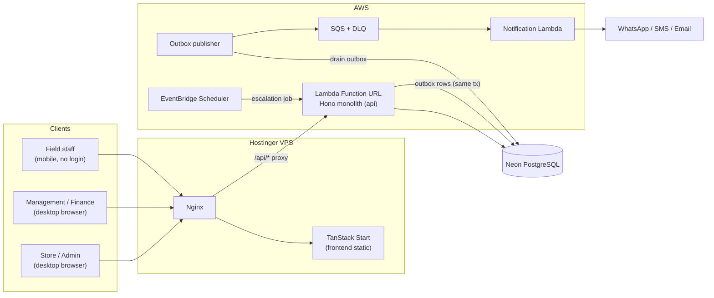

# HERMS System Architecture

High-level view of how the Hotel Equipment Rental Management System is deployed and how its pieces communicate. This is derived from the SRS v1.0 (`Project Overview.md`), the `IMPORTANT .docx` client notes, and the `Untitled Diagram.drawio.png` deployment diagram.

Companion documents:

- [Backend](backend.md) — Hono monolith, domain services, outbox, notifications.
- [Database Schema](database-schema.md) — Neon PostgreSQL, Drizzle, tables and invariants.
- [Frontend](frontend.md) — TanStack Start, back-office and mobile link forms.

## Topology



## Components

| Component | Runtime | Responsibility |
|---|---|---|
| Frontend | TanStack Start on Hostinger VPS behind Nginx | Back-office screens for sales, store admin, finance, management; mobile link forms for field staff |
| Nginx | Hostinger VPS | Serve static frontend; proxy `/api/*` same-origin to the Lambda Function URL |
| API | Hono monolith on AWS Lambda Function URL | All business logic, authorization, validation, transactions, outbox writes |
| Database | Neon PostgreSQL (serverless) | Source of truth; append-only stock ledger, price history, audit log, outbox |
| Outbox publisher | Part of the API (or a separate worker) | Drain `outbox` rows into SQS after commit |
| Queue | AWS SQS + dead-letter queue | Reliable, at-least-once delivery of notification intents |
| Notifier | Separate Notification Lambda | Consume SQS, call WhatsApp/SMS/email provider |
| Scheduler | EventBridge Scheduler (or equivalent) | Daily idempotent check for six-month price escalation |

## Request Flows

### Synchronous (user request)

```
browser → Nginx → /api/* → Hono Lambda → Neon → JSON response
```

### Asynchronous (notification)

```
business change + outbox row (same DB transaction)
        → publisher drains outbox
        → SQS
        → Notification Lambda
        → provider (WhatsApp primary, SMS fallback, email back-office)
        → DLQ + alarm on failure
```

### Scheduled (price escalation)

```
daily scheduler → "is any item due?" (idempotent per item + effective date)
        → +10% escalation → append price_history row
```

## Key Architectural Decisions

1. **Two runtimes** — static frontend on the VPS, serverless API on Lambda. The API could move onto the VPS if cold-start measurements from Phase 0 are poor (see [Architecture Risks](../roadmap/architecture-risks.md)).
2. **Transactional outbox** — notification intents are durable with the business change; the provider is never called from the request path (Invariant I-12).
3. **Serverless-safe DB driver** — Neon HTTP/serverless driver, no per-invocation TCP pool.
4. **Append-only records** — stock ledger, price history, and audit log are append-only (Invariants I-1, I-3, I-8).
5. **Integer money** — all monetary values in minor units (cents), never floats (Invariant I-10).
6. **Same-origin proxy** — Nginx hides CORS; `proxy_read_timeout` must exceed the Lambda timeout.

## Non-negotiable Rules

The full set of rules every component must respect lives in [Invariants](../roadmap/invariants.md). The most structural ones:

- Stock moves only through an approved note (I-1).
- Price history is immutable (I-3).
- Claim pricing uses the date-of-damage price (I-4).
- Order documents freeze their prices (I-11).
- Outbox before provider (I-12).

## Known Risks

Cold-start latency vs the 3-second dashboard NFR, Neon autosuspend behaviour, connection exhaustion, the two-runtime cost trade-off, proxy timeouts, token leakage, and public Lambda Function URL hardening. See [Architecture Risks](../roadmap/architecture-risks.md).
