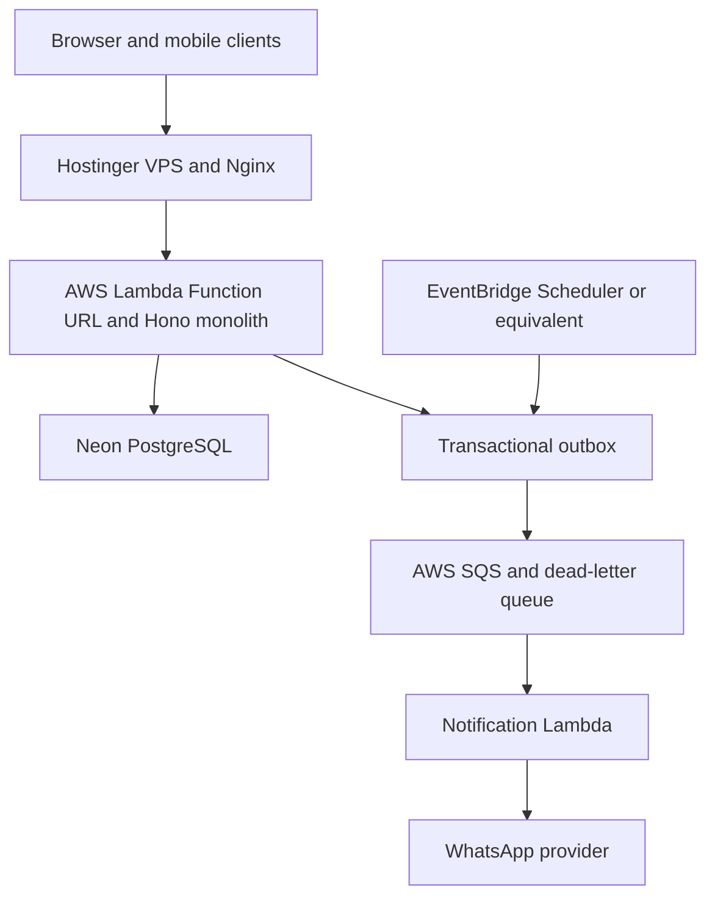

# HERMS Implementation Roadmap

This roadmap translates the requirements in [`Project Overview.md`](../../Project%20Overview.md), the supplementary client notes in `IMPORTANT .docx`, and the supplied `Untitled Diagram.drawio.png` architecture diagram into an implementation sequence.

The phases are ordered by dependency and risk. Each phase has its own document under [`phases/`](phases/). Decisions that must be confirmed before implementation are listed in [`decisions/open-items-and-risks.md`](decisions/open-items-and-risks.md).

## Delivery Order

| Order | Phase | Outcome | Priority |
|---|---|---|---|
| 1 | [Platform Foundation](phases/phase-01-platform-foundation.md) | Secure, auditable, deployable control plane | Must have |
| 2 | [Commercial Core](phases/phase-02-commercial-core.md) | Customers, pricing, quotations, and orders | Must have |
| 3 | [Field Operations](phases/phase-03-field-operations.md) | Delivery and retention notes through mobile links | Must have |
| 4 | [Approval and Inventory](phases/phase-04-approval-and-inventory.md) | Store approval, stock ledger, and discrepancies | Must have |
| 5 | [Finance and Reporting](phases/phase-05-finance-and-reporting.md) | Payments, claims, and management dashboards | Must have |
| 6 | [Notifications and Scheduling](phases/phase-06-notifications-and-scheduling.md) | Reliable notifications, link lifecycle, and escalation | Production gate |
| 7 | [Agentic Workflow](phases/phase-07-agentic-workflow.md) | Safe human-in-the-loop assistance | Later / optional |

## Architecture Alignment

The implementation should follow the dependency direction shown in the architecture diagram:

The backend and database are implemented before asynchronous infrastructure. The outbox is required so a successful database transaction cannot lose its notification or scheduled-work event. EventBridge is an implementation option; six-month price escalation is a business requirement and is not optional.

## MVP Boundary

The MVP includes Phases 1 through 6. Phase 7 is deliberately excluded from the first production release until the deterministic workflows, authorization, audit trail, and operational monitoring have been proven.

The MVP is not complete unless it can enforce these controls:

- No stock quantity changes before Store Admin approval.
- Every stock, payment, discrepancy, price, and claim action has an accountable actor.
- Note links are scoped, time-bound or single-use, and revocable.
- Repeated requests and retried events do not duplicate business effects.
- Customer claims use the approved responsibility and historical price rules.
- Failed notifications are retried, observable, and recoverable through a dead-letter queue.

## Planning Principles

1. Implement business rules in deterministic backend domain services.
2. Treat audit history and source-document links as first-class data.
3. Keep stock, financial, pricing, and authorization decisions outside the agent layer.
4. Introduce asynchronous processing only after transaction boundaries and idempotency are defined.
5. Preserve a manual fallback for every automated or agent-assisted workflow.

## Source Documents

- [`Project Overview.md`](../../Project%20Overview.md), SRS v1.0.
- `IMPORTANT .docx`, supplementary client notes used during planning.
- `Untitled Diagram.drawio.png`, proposed deployment architecture used during planning.
