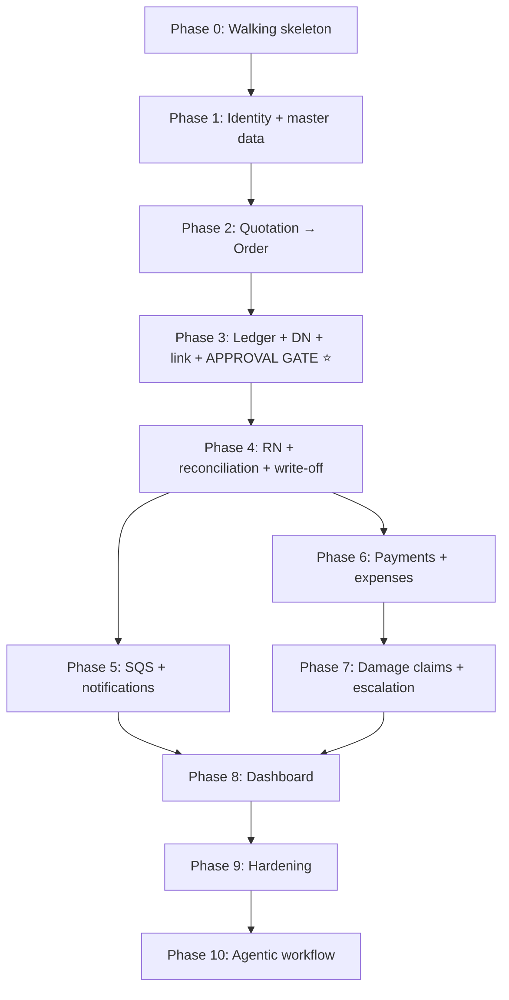

# HERMS Implementation Roadmap

This roadmap translates the requirements in [`Project Overview.md`](../../Project%20Overview.md) (SRS v1.0, 11 Aug 2026), the supplementary client notes in `IMPORTANT .docx`, and the supplied `Untitled Diagram.drawio.png` architecture diagram into a delivery sequence.

Read this before starting any work. Phases are ordered by dependency, not by how interesting the feature is.

## Ordering Rationale

> Data integrity before money, money before dashboards, dashboards before nice-to-haves.

1. **The Store Admin approval gate (BR-4) is the spine of the system.** Stock, discrepancies, damage claims, and every financial number ultimately derive from an approved note. Build the gate before anything that reads from it.
2. **Finance is downstream of discrepancies.** A damage claim (FR-9.1) cannot exist until a discrepancy has a confirmed responsible party (FR-4.3).
3. **The dashboard is downstream of everything.** Building it early means building it three times.
4. **WhatsApp is a long-lead external dependency, not a phase.** Business API / BSP onboarding takes weeks and is still an open client item (SRS §10.2). Start the application in Phase 0, ship Phases 1–4 behind a copy-link fallback, and land the channel in Phase 5.

## Invariants

Twelve non-negotiable rules govern every phase. An agent may not weaken one to make a task pass — if a task appears to require breaking one, stop and raise it. They are the single source of truth for stock, price history, claims, reconciliation, attribution, links, money, and notification ordering. See [Invariants](invariants.md).

## Architecture

Component-level design lives in the [architecture docs](../architecture/):

- [System Architecture](../architecture/system-architecture.md) — topology, flows, decisions.
- [Backend](../architecture/backend.md) — Hono monolith, domain services, outbox.
- [Database Schema](../architecture/database-schema.md) — Neon PostgreSQL, tables, invariants.
- [Frontend](../architecture/frontend.md) — TanStack Start, back-office and mobile forms.

## Delivery Order

| Order | Phase | Outcome | Priority |
|---|---|---|---|
| 0 | [Walking Skeleton](phases/phase-00-walking-skeleton.md) | One request travels browser → Nginx → Lambda → Neon → back, in CI | Must have |
| 1 | [Identity, RBAC and Master Data](phases/phase-01-identity-rbac-master-data.md) | Users, roles, customers, items, append-only price history, audit log | Must have |
| 2 | [Quotation → Order](phases/phase-02-quotation-order.md) | Correct pricing, quotation status machine, order conversion | Must have |
| 3 | [Stock Ledger, Delivery Note and Approval Gate ⭐](phases/phase-03-stock-ledger-delivery-approval.md) | Append-only stock ledger, link submission, approval gate | Must have |
| 4 | [Retention Note, Reconciliation and Write-off](phases/phase-04-retention-reconciliation-writeoff.md) | Returns, cumulative reconciliation, write-offs | Must have |
| 5 | [Async Spine and Notifications](phases/phase-05-async-notifications.md) | SQS + DLQ + notification Lambda, WhatsApp/SMS | Production gate |
| 6 | [Payments, Invoicing and Expenses](phases/phase-06-payments-invoicing-expenses.md) | Invoice values, partial payments, balances, expenses | Must have |
| 7 | [Damage Claims and Price Escalation](phases/phase-07-damage-claims-escalation.md) | Claims with Finance review, point-in-time pricing, +10% escalation | Must have |
| 8 | [Dashboard and Reporting](phases/phase-08-dashboard-reporting.md) | Real reconciled management views and export | Must have |
| 9 | [Hardening and Could-haves](phases/phase-09-hardening-could-haves.md) | NFR verification, printed layouts, backups | Should have |
| 10 | [Agentic Workflow](phases/phase-10-agentic-workflow.md) | Safe human-in-the-loop assistance | Later / optional |

## Dependency Graph

- **Phases 5 and 6 are parallelisable once Phase 4 lands.** Nothing else is.
- Phase 5 (notifications) and Phase 6 (payments) both read Phase 4 output but do not depend on each other.

## Long-lead Items to Start Immediately

These do not block Phase 0 and must be started in parallel:

- WhatsApp Business API / BSP account application (SRS §4.3, §10.2).
- Client confirmation of the printed/PDF Delivery Note and Retention Note layouts (SRS §10.2, §11.1, §11.2).

## MVP Boundary

The MVP includes Phases 0 through 8. Phase 9 is hardening; Phase 10 is excluded from the first production release until deterministic workflows, authorization, audit, and operational recovery paths have been proven.

The MVP is not complete unless it can enforce these controls:

- No stock quantity changes before Store Admin physical count and approval (BR-4).
- Stock is an append-only ledger; current quantity is derived, never mutated in place.
- Every stock, payment, discrepancy, price, and claim action has an accountable actor.
- Note links are scoped, time-bound or single-use, and revocable.
- Quotations and orders retain the exact price agreed at the time.
- Notifications are idempotent and recoverable through a dead-letter queue.
- Customer claims use the approved responsibility and point-in-time historical price rules.

## Architecture Risks

Cold-start behaviour, Neon connection handling, the two-runtime trade-off, proxy timeouts, and token leakage are decisions to make early. See [Architecture Risks](architecture-risks.md).

## Open Decisions

Client confirmations and requirement ambiguities that must be resolved before their phase closes are tracked in [Open Decisions](open-decisions.md).

## Source Documents

- [`Project Overview.md`](../../Project%20Overview.md), SRS v1.0.
- `IMPORTANT .docx`, supplementary client notes used during planning.
- `Untitled Diagram.drawio.png`, proposed deployment architecture used during planning.
